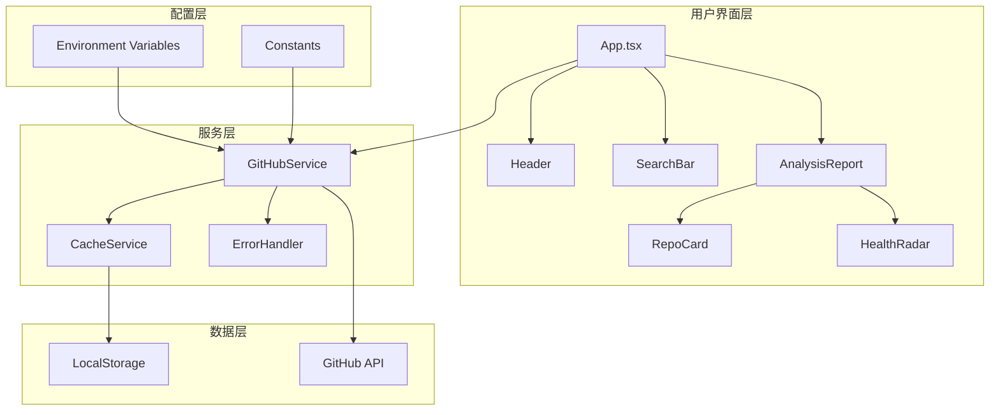
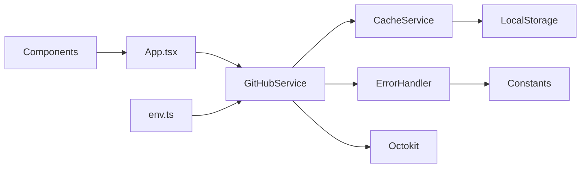
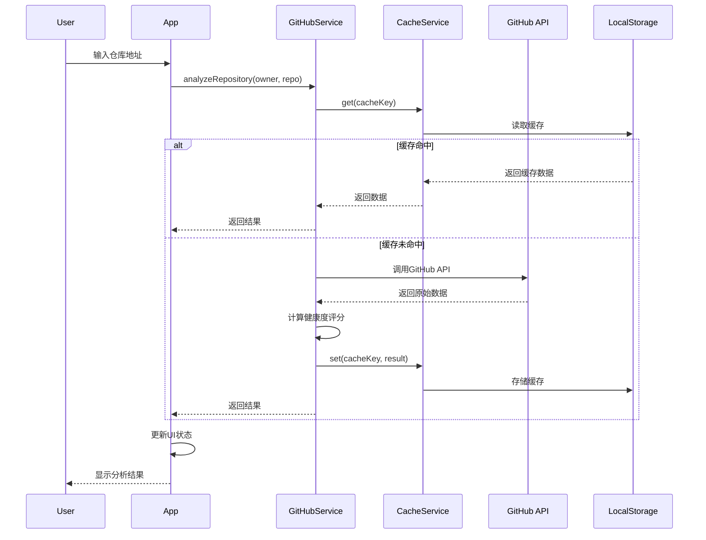
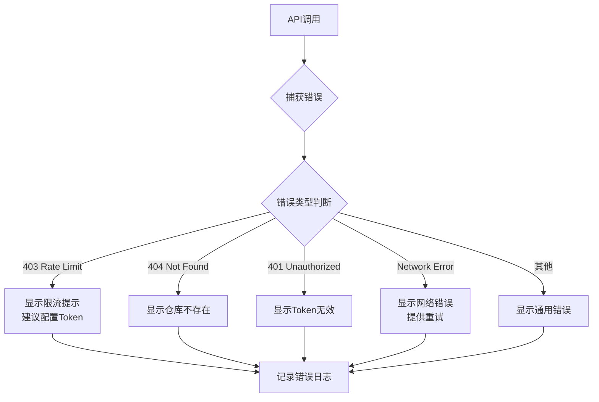
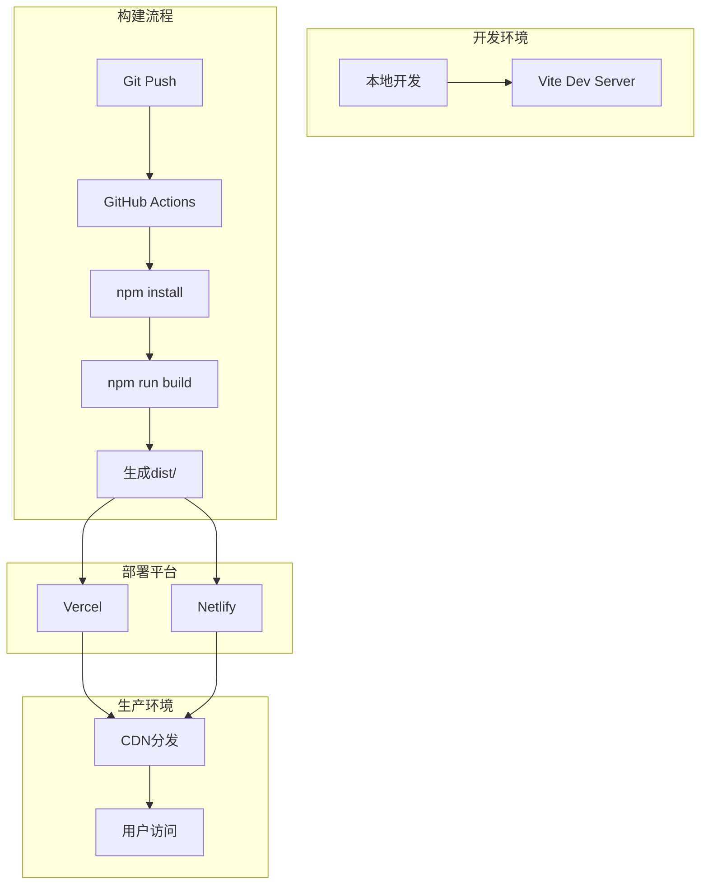

# CodePulse Lite 架构设计文档

## 整体架构图



## 系统分层设计

### 1. 表现层 (Presentation Layer)
**职责**: UI渲染、用户交互、状态管理

**核心组件**:
- `App.tsx`: 应用根组件，状态管理中心
- `Header.tsx`: 顶部导航
- `SearchBar.tsx`: 搜索输入组件
- `AnalysisReport.tsx`: 分析结果展示
- `RepoCard.tsx`: 仓库信息卡片
- `HealthRadar.tsx`: 健康度雷达图

**优化点**:
- 添加错误边界组件
- 优化加载状态展示
- 添加空状态提示

### 2. 服务层 (Service Layer)
**职责**: 业务逻辑、API调用、数据处理

**核心服务**:

#### GitHubService (已存在，需增强)
```typescript
class GitHubService {
  - octokit: Octokit
  - cache: CacheService
  
  + analyzeRepository(owner, repo): Promise<AnalysisResult>
  + searchRepositories(query): Promise<RepoInfo[]>
  - calculateHealthScore(data): HealthScore
  - handleAPIError(error): never
}
```

#### CacheService (新增)
```typescript
class CacheService {
  - CACHE_PREFIX: string
  - CACHE_DURATION: number
  
  + get<T>(key: string): T | null
  + set<T>(key: string, data: T): void
  + clear(key?: string): void
  + isExpired(key: string): boolean
}
```

#### ErrorHandler (新增)
```typescript
class ErrorHandler {
  + static handle(error: unknown): UserFriendlyError
  + static isRateLimitError(error): boolean
  + static isNotFoundError(error): boolean
  + static formatMessage(error): string
}
```

### 3. 数据层 (Data Layer)
**职责**: 数据持久化、缓存管理

**实现方式**:
- LocalStorage: 分析历史、缓存数据
- SessionStorage: 临时会话数据

### 4. 配置层 (Configuration Layer)
**职责**: 环境配置、常量定义

**文件结构**:
```
src/
  ├── config/
  │   └── env.ts          # 环境变量封装
  ├── constants/
  │   ├── api.ts          # API相关常量
  │   ├── cache.ts        # 缓存配置
  │   └── messages.ts     # 错误消息
  └── utils/
      ├── cache.ts        # 缓存工具
      └── error.ts        # 错误处理工具
```

## 核心组件详细设计

### 1. 环境配置模块

**文件**: `src/config/env.ts`
```typescript
export const config = {
  github: {
    token: import.meta.env.VITE_GITHUB_TOKEN || '',
    apiUrl: 'https://api.github.com'
  },
  cache: {
    enabled: true,
    duration: 30 * 60 * 1000 // 30分钟
  },
  app: {
    name: 'CodePulse Lite',
    version: '1.0.0'
  }
}
```

### 2. 缓存模块

**文件**: `src/utils/cache.ts`
```typescript
interface CacheEntry<T> {
  data: T;
  timestamp: number;
  expiresAt: number;
}

export class CacheService {
  private readonly prefix = 'codepulse_';
  private readonly duration: number;
  
  constructor(duration: number = 30 * 60 * 1000) {
    this.duration = duration;
  }
  
  get<T>(key: string): T | null
  set<T>(key: string, data: T): void
  clear(key?: string): void
  private isExpired(entry: CacheEntry<T>): boolean
}
```

### 3. 错误处理模块

**文件**: `src/utils/error.ts`
```typescript
export enum ErrorType {
  RATE_LIMIT = 'RATE_LIMIT',
  NOT_FOUND = 'NOT_FOUND',
  UNAUTHORIZED = 'UNAUTHORIZED',
  NETWORK = 'NETWORK',
  UNKNOWN = 'UNKNOWN'
}

export class APIError extends Error {
  constructor(
    message: string,
    public type: ErrorType,
    public statusCode?: number,
    public details?: unknown
  ) {
    super(message);
    this.name = 'APIError';
  }
}

export class ErrorHandler {
  static handle(error: unknown): APIError
  static getUserMessage(error: APIError): string
  static shouldRetry(error: APIError): boolean
}
```

### 4. GitHub服务增强

**文件**: `src/services/github.ts`
```typescript
export class GitHubService {
  private octokit: Octokit;
  private cache: CacheService;
  
  constructor(token?: string) {
    this.octokit = new Octokit({ auth: token });
    this.cache = new CacheService();
  }
  
  // 增强的分析方法，包含缓存和错误处理
  async analyzeRepository(owner: string, repo: string): Promise<AnalysisResult> {
    const cacheKey = `repo-${owner}-${repo}`;
    
    // 尝试从缓存获取
    const cached = this.cache.get<AnalysisResult>(cacheKey);
    if (cached) return cached;
    
    try {
      // API调用逻辑
      const result = await this.performAnalysis(owner, repo);
      
      // 缓存结果
      this.cache.set(cacheKey, result);
      
      return result;
    } catch (error) {
      throw ErrorHandler.handle(error);
    }
  }
  
  private async performAnalysis(owner: string, repo: string): Promise<AnalysisResult>
  private handleAPIError(error: unknown): never
}
```

## 模块依赖关系图



## 接口契约定义

### 1. GitHubService接口

```typescript
interface IGitHubService {
  /**
   * 分析GitHub仓库
   * @param owner - 仓库所有者
   * @param repo - 仓库名称
   * @returns 分析结果
   * @throws {APIError} 当API调用失败时
   */
  analyzeRepository(owner: string, repo: string): Promise<AnalysisResult>;
  
  /**
   * 搜索GitHub仓库
   * @param query - 搜索关键词
   * @param perPage - 每页数量，默认10
   * @returns 仓库列表
   */
  searchRepositories(query: string, perPage?: number): Promise<RepoInfo[]>;
}
```

### 2. CacheService接口

```typescript
interface ICacheService {
  /**
   * 获取缓存数据
   * @param key - 缓存键
   * @returns 缓存的数据或null
   */
  get<T>(key: string): T | null;
  
  /**
   * 设置缓存数据
   * @param key - 缓存键
   * @param data - 要缓存的数据
   * @param duration - 可选的过期时间(毫秒)
   */
  set<T>(key: string, data: T, duration?: number): void;
  
  /**
   * 清除缓存
   * @param key - 可选的缓存键，不传则清除所有
   */
  clear(key?: string): void;
}
```

### 3. ErrorHandler接口

```typescript
interface IErrorHandler {
  /**
   * 处理错误并转换为APIError
   * @param error - 原始错误对象
   * @returns 标准化的APIError
   */
  handle(error: unknown): APIError;
  
  /**
   * 获取用户友好的错误消息
   * @param error - APIError对象
   * @returns 用户可读的错误消息
   */
  getUserMessage(error: APIError): string;
}
```

## 数据流向图



## 异常处理策略

### 错误分类处理



### 错误恢复机制

1. **Rate Limit处理**
   - 检测剩余配额
   - 显示重置时间
   - 引导用户配置Token

2. **网络错误**
   - 自动重试(最多3次)
   - 指数退避策略
   - 提供手动重试按钮

3. **认证错误**
   - 清除无效Token
   - 引导用户重新配置
   - 降级到公开API

## 性能优化策略

### 1. 缓存策略
- 分析结果缓存30分钟
- 搜索结果缓存5分钟
- LRU淘汰策略(保留最近20条)

### 2. 请求优化
- 并行请求(commits, contributors, issues)
- 请求节流(防抖300ms)
- 分页加载(按需加载)

### 3. UI优化
- 骨架屏加载
- 虚拟滚动(长列表)
- 图片懒加载

### 4. 构建优化
- 代码分割
- Tree Shaking
- 压缩优化

## 安全策略

### 1. 敏感信息保护
- Token存储在环境变量
- 不在日志中输出Token
- .gitignore配置完善

### 2. XSS防护
- React自动转义
- DOMPurify清理用户输入(如需)

### 3. CORS处理
- 通过GitHub API代理
- 正确设置请求头

## 部署架构



## 质量保证

### 1. 代码质量
- ESLint检查
- TypeScript严格模式
- Prettier格式化

### 2. 构建检查
- 类型检查通过
- 构建无警告
- 打包体积合理(<500KB)

### 3. 运行时检查
- 错误边界捕获
- 性能监控
- 用户行为追踪(可选)

---

**文档状态**: ✅ 已完成
**创建时间**: 2025-10-30
**下一阶段**: Atomize (任务拆解)
