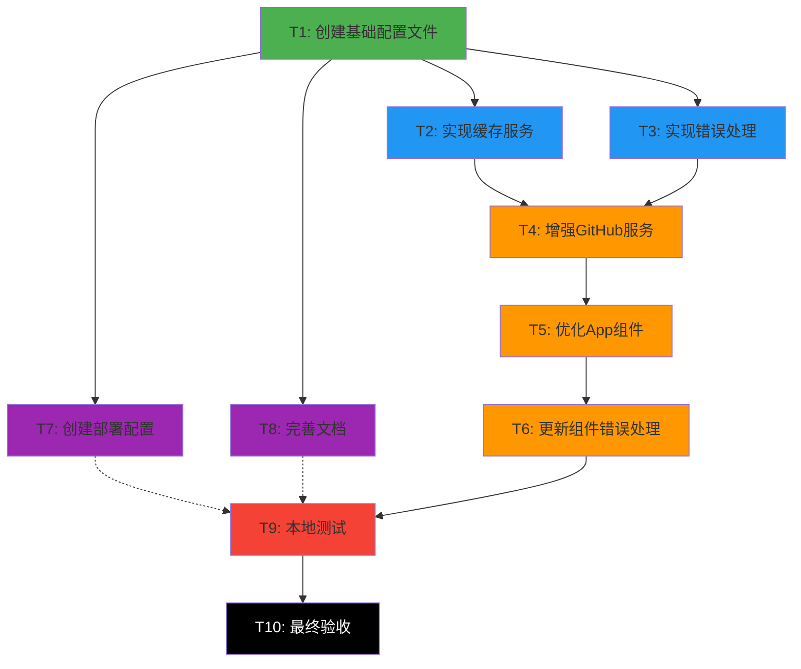

# CodePulse Lite 任务拆解文档

## 任务依赖关系图

## 原子任务列表

### T1: 创建基础配置文件
**优先级**: P0 (最高)
**预计时间**: 10分钟
**依赖**: 无

#### 输入契约
- 前置依赖: 无
- 环境依赖: Node.js, npm已安装

#### 输出契约
- 交付物:
  - `.env.example` - 环境变量模板
  - `.gitignore` - 更新忽略规则
  - `src/config/env.ts` - 环境配置封装
  - `src/constants/` - 常量定义文件

#### 实现约束
- 遵循Vite环境变量规范(VITE_前缀)
- .gitignore必须包含.env*
- 配置文件使用TypeScript

#### 验收标准
- [ ] .env.example包含所有必需变量
- [ ] .gitignore正确配置
- [ ] env.ts可正确读取环境变量
- [ ] TypeScript类型正确

---

### T2: 实现缓存服务
**优先级**: P1
**预计时间**: 15分钟
**依赖**: T1

#### 输入契约
- 前置依赖: T1完成
- 输入数据: 缓存配置常量

#### 输出契约
- 交付物:
  - `src/utils/cache.ts` - CacheService类
  - `src/constants/cache.ts` - 缓存常量

#### 实现约束
- 使用LocalStorage
- 支持泛型
- 实现过期机制
- 提供clear方法

#### 验收标准
- [ ] get/set方法工作正常
- [ ] 过期检测正确
- [ ] 类型安全
- [ ] 支持序列化/反序列化

---

### T3: 实现错误处理
**优先级**: P0
**预计时间**: 20分钟
**依赖**: T1

#### 输入契约
- 前置依赖: T1完成
- 输入数据: 错误类型定义

#### 输出契约
- 交付物:
  - `src/utils/error.ts` - ErrorHandler类
  - `src/constants/messages.ts` - 错误消息常量
  - `src/types/index.ts` - 更新错误类型

#### 实现约束
- 继承Error类
- 支持错误类型枚举
- 提供用户友好消息
- 记录错误详情

#### 验收标准
- [ ] 错误分类完整
- [ ] 消息清晰易懂
- [ ] TypeScript类型完整
- [ ] 支持错误堆栈

---

### T4: 增强GitHub服务
**优先级**: P0
**预计时间**: 25分钟
**依赖**: T2, T3

#### 输入契约
- 前置依赖: T2, T3完成
- 输入数据: CacheService, ErrorHandler
- 环境依赖: GitHub API可访问

#### 输出契约
- 交付物:
  - `src/services/github.ts` - 增强版服务

#### 实现约束
- 集成CacheService
- 集成ErrorHandler
- 使用环境变量Token
- 保持现有接口兼容

#### 验收标准
- [ ] 缓存功能正常
- [ ] 错误处理完整
- [ ] Token从环境变量读取
- [ ] 现有功能不受影响
- [ ] API调用成功

---

### T5: 优化App组件
**优先级**: P1
**预计时间**: 15分钟
**依赖**: T4

#### 输入契约
- 前置依赖: T4完成
- 输入数据: 增强的GitHubService

#### 输出契约
- 交付物:
  - `src/App.tsx` - 优化版本

#### 实现约束
- 改进错误展示
- 优化加载状态
- 添加空状态提示
- 保持现有UI风格

#### 验收标准
- [ ] 错误消息友好
- [ ] 加载状态流畅
- [ ] 空状态有提示
- [ ] UI无闪烁
- [ ] TypeScript无错误

---

### T6: 更新组件错误处理
**优先级**: P2
**预计时间**: 10分钟
**依赖**: T5

#### 输入契约
- 前置依赖: T5完成
- 输入数据: 优化后的App组件

#### 输出契约
- 交付物:
  - 更新所有子组件的错误处理

#### 实现约束
- 添加错误边界(可选)
- 统一错误样式
- 保持组件独立性

#### 验收标准
- [ ] 组件有错误处理
- [ ] 错误不影响其他组件
- [ ] UI一致性

---

### T7: 创建部署配置
**优先级**: P0
**预计时间**: 15分钟
**依赖**: T1

#### 输入契约
- 前置依赖: T1完成
- 环境依赖: 了解Vercel/Netlify配置

#### 输出契约
- 交付物:
  - `vercel.json` - Vercel配置
  - `netlify.toml` - Netlify配置
  - `.github/workflows/deploy.yml` - CI/CD配置

#### 实现约束
- 支持环境变量
- 正确构建配置
- 优化性能设置

#### 验收标准
- [ ] Vercel配置正确
- [ ] Netlify配置正确
- [ ] GitHub Actions语法正确
- [ ] 环境变量配置清晰

---

### T8: 完善文档
**优先级**: P0
**预计时间**: 20分钟
**依赖**: T1

#### 输入契约
- 前置依赖: T1完成
- 输入数据: 所有配置文件

#### 输出契约
- 交付物:
  - `README.md` - 完整更新
  - `DEPLOYMENT.md` - 部署指南
  - `CONTRIBUTING.md` - 贡献指南

#### 实现约束
- 使用Markdown格式
- 包含清晰的步骤说明
- 提供代码示例
- 包含常见问题

#### 验收标准
- [ ] README结构清晰
- [ ] 部署步骤详细
- [ ] 环境变量说明完整
- [ ] 代码示例正确
- [ ] 无拼写错误

---

### T9: 本地测试
**优先级**: P0
**预计时间**: 15分钟
**依赖**: T6, T7, T8

#### 输入契约
- 前置依赖: T6, T7, T8完成
- 环境依赖: Node.js环境

#### 输出契约
- 交付物:
  - 测试报告
  - 错误修复

#### 实现约束
- 完整的功能测试
- 构建测试
- 类型检查

#### 验收标准
- [ ] npm install成功
- [ ] npm run dev启动成功
- [ ] npm run build构建成功
- [ ] npm run lint无错误
- [ ] TypeScript类型检查通过
- [ ] 功能正常运行

---

### T10: 最终验收
**优先级**: P0
**预计时间**: 10分钟
**依赖**: T9

#### 输入契约
- 前置依赖: T9完成
- 输入数据: 完整项目

#### 输出契约
- 交付物:
  - `docs/项目完善/ACCEPTANCE_项目完善.md`
  - `docs/项目完善/FINAL_项目完善.md`
  - `docs/项目完善/TODO_项目完善.md`

#### 实现约束
- 对照验收标准逐项检查
- 记录所有问题
- 确认所有功能

#### 验收标准
- [ ] 所有P0任务完成
- [ ] 文档完整准确
- [ ] 代码质量达标
- [ ] 可成功部署
- [ ] 无严重bug

---

## 任务执行顺序

### 第一批 (并行执行)
- T1: 创建基础配置文件

### 第二批 (并行执行)
- T2: 实现缓存服务
- T3: 实现错误处理
- T7: 创建部署配置
- T8: 完善文档

### 第三批 (顺序执行)
- T4: 增强GitHub服务
- T5: 优化App组件
- T6: 更新组件错误处理

### 第四批 (顺序执行)
- T9: 本地测试
- T10: 最终验收

## 风险评估

| 任务 | 风险等级 | 风险描述 | 缓解措施 |
|------|----------|----------|----------|
| T1 | 低 | 配置错误 | 参考Vite官方文档 |
| T2 | 低 | LocalStorage限制 | 实现容量检测 |
| T3 | 中 | 错误分类不全 | 参考GitHub API文档 |
| T4 | 中 | API兼容性 | 充分测试 |
| T5-T6 | 低 | UI兼容性 | 保持现有样式 |
| T7 | 中 | 部署配置错误 | 提供多平台配置 |
| T8 | 低 | 文档遗漏 | 详细检查清单 |
| T9 | 高 | 功能异常 | 完整测试流程 |

## 资源需求

### 开发资源
- 总预计时间: 2.5小时
- 开发人员: 1人(AI)

### 外部依赖
- GitHub API可访问
- Node.js v18+
- npm v9+

### 用户需提供
- GitHub Personal Access Token (可选)
- 部署平台账号 (Vercel/Netlify)

## 质量检查点

### 代码质量
- [ ] ESLint检查通过
- [ ] TypeScript编译无错误
- [ ] 无console.log残留
- [ ] 代码注释充分

### 功能质量
- [ ] 核心功能正常
- [ ] 错误处理完整
- [ ] 加载状态正确
- [ ] 缓存功能正常

### 文档质量
- [ ] README完整
- [ ] 部署指南清晰
- [ ] API文档准确
- [ ] 代码注释充分

---

**文档状态**: ✅ 已完成
**创建时间**: 2025-10-30
**下一阶段**: Approve (审批确认)
